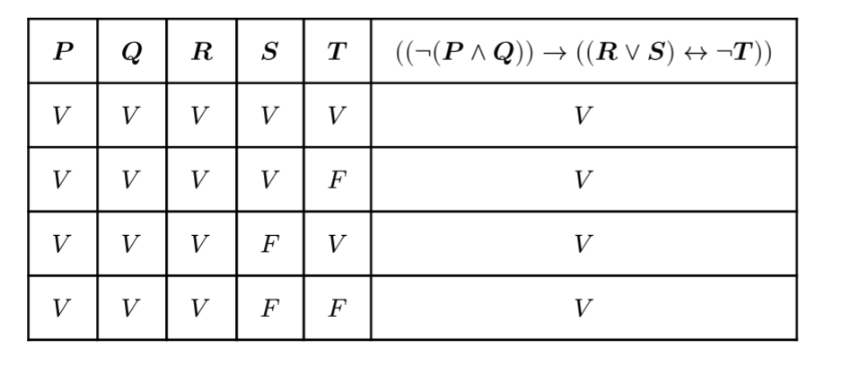

# prop-logic-paevty

Build and run the executable:

```
cabal run
```

Parse, evaluate and create typst truth tables from plain-text logical propositions.

Input: `"((not (P and Q)) then ((R or S) bithen not T))"`.
```
#let then = $arrow$
#let bithen = $arrow.l.r$

#table(
  columns: (auto, auto, auto, auto, auto, auto),
  inset: 10pt,
  align: horizon,
  [*$P$*], [*$Q$*], [*$R$*], [*$S$*], [*$T$*],  [*$((not (P and Q)) then ((R or S) bithen not T))$*],

  $V$, $V$, $V$, $V$, $V$, align(center)[$V$], 
  $V$, $V$, $V$, $V$, $F$, align(center)[$V$], 
  $V$, $V$, $V$, $F$, $V$, align(center)[$V$], 
  $V$, $V$, $V$, $F$, $F$, align(center)[$V$], 
  $V$, $V$, $F$, $V$, $V$, align(center)[$V$], 
  $V$, $V$, $F$, $V$, $F$, align(center)[$V$], 
  $V$, $V$, $F$, $F$, $V$, align(center)[$V$], 
  $V$, $V$, $F$, $F$, $F$, align(center)[$V$], 
  $V$, $F$, $V$, $V$, $V$, align(center)[$F$], 
  $V$, $F$, $V$, $V$, $F$, align(center)[$V$], 
  $V$, $F$, $V$, $F$, $V$, align(center)[$F$], 
  $V$, $F$, $V$, $F$, $F$, align(center)[$V$], 
  $V$, $F$, $F$, $V$, $V$, align(center)[$F$], 
  $V$, $F$, $F$, $V$, $F$, align(center)[$V$], 
  $V$, $F$, $F$, $F$, $V$, align(center)[$V$], 
  $V$, $F$, $F$, $F$, $F$, align(center)[$F$], 
  $F$, $V$, $V$, $V$, $V$, align(center)[$F$], 
  $F$, $V$, $V$, $V$, $F$, align(center)[$V$], 
  $F$, $V$, $V$, $F$, $V$, align(center)[$F$], 
  $F$, $V$, $V$, $F$, $F$, align(center)[$V$], 
  $F$, $V$, $F$, $V$, $V$, align(center)[$F$], 
  $F$, $V$, $F$, $V$, $F$, align(center)[$V$], 
  $F$, $V$, $F$, $F$, $V$, align(center)[$V$], 
  $F$, $V$, $F$, $F$, $F$, align(center)[$F$], 
  $F$, $F$, $V$, $V$, $V$, align(center)[$F$], 
  $F$, $F$, $V$, $V$, $F$, align(center)[$V$], 
  $F$, $F$, $V$, $F$, $V$, align(center)[$F$], 
  $F$, $F$, $V$, $F$, $F$, align(center)[$V$], 
  $F$, $F$, $F$, $V$, $V$, align(center)[$F$], 
  $F$, $F$, $F$, $V$, $F$, align(center)[$V$], 
  $F$, $F$, $F$, $F$, $V$, align(center)[$V$], 
  $F$, $F$, $F$, $F$, $F$, align(center)[$F$], 

)
```

Preview:

